 

 

##  What it does

Installing a large mod collection by hand means clicking through requirement screens, ad panels and
download pages, one file at a time, for an hour. This extension turns that into: open the collection
page, press start, walk away.

It handles two download modes — **send to Vortex** or **download in the browser** — queues the whole
list, paces itself so Nexus does not rate-limit you, and keeps a local history so an interrupted run
can pick up where it stopped instead of starting over.

##  Features

### The download flow

- **Auto-start downloads** when you land on a file page — no extra click.
- **Skip requirement screens** and go straight to the download step.
- **Archived file buttons** — adds Vortex and browser download buttons back to archived entries that
  Nexus hides.
- **Auto-close Vortex tabs** after the handoff, with a delay you control. The tab announces the
  close with a countdown and a **Keep open** button, because nothing can confirm that Vortex
  actually received the link.
- **Cloudflare fallback** — when Nexus answers a background request with a verification page, the
  file page is opened so you can clear the check, rather than the download simply failing. It can
  be switched off, and it gives up on its own if the page never produces a download control.
- **Clear error messages** when Nexus fails to return a usable link, instead of a silent dead end.

### Collection downloader

- Detects collection pages and builds a **Ready Queue** of everything in the revision.
- Choose your method per run: **Send to Vortex** or **Browser download**.
- **Time left for the whole run** — browser mode shows how long the rest of the queue should take,
  worked out from the speed the run is actually achieving, not from a setting. It appears once the
  first file has finished, because before that there is nothing to measure.
- **Paced queue** — a configurable pause between mods, plus a speed estimate for Vortex mode,
  because the browser cannot see a transfer happening inside Vortex.
- **Rate-limit aware** — if Nexus throttles you, the queue pauses and resumes on its own.
- **Local download history** — already-downloaded mods are recognised, so you can pick
  *Skip Downloaded* or *Re-download All* when you retry a collection.
- **Update collection** — compare revisions to see what actually changed.
- **Wabbajack modlist import (beta)** — read a `.wabbajack` file to seamlessly queue its Nexus mods.
  The `.zip` you downloaded works too; the modlist is found inside it. A `.rar` or `.7z` has to be
  extracted first, since a browser cannot open those.
- Runs in the background service worker, so it survives tab navigation.

### Quality of life

- **Hide ads and Premium panels** — advertising slots, empty ad containers and upgrade banners are
  collapsed while you browse. It also keeps the Nexus ad-timer cookie current, which is what lets a
  queued download skip the countdown before each link, so leaving it on matters for collection runs
  and not only for how the page looks. See [PRIVACY.md](PRIVACY.md) for exactly what that cookie is.
- **Guided onboarding page** the first time you install.
- **Built-in bug reporter** that attaches recent extension errors, and the last few things the
  extension did before the fault, to a pre-filled GitHub issue. Nothing to switch on beforehand, and
  the draft is yours to read and edit before submitting.
- **Support panel** — entirely optional, never gates a feature.

###  Languages

English, Greek, German, Spanish, French, Italian, Japanese, Korean, Polish, Portuguese (BR),
Russian, Turkish, Simplified Chinese — 349 strings each (a few more or fewer where a language's
plural rules need extra forms). There is also an **Always use English**
switch for when your browser language and your Nexus language disagree.

##  Install

The recommended and easiest way to install NexusMods Bypass is directly through your browser's official store:

-  **[Chrome Web Store](https://chromewebstore.google.com/detail/nexusmods-bypass/chfghiknjhpcncpcjopglefnckckdlpj)**
-  **[Microsoft Edge Add-ons](https://microsoftedge.microsoft.com/addons/detail/nexusmods-bypass/hcjpcnajmkanhodhpkoinodjbkeolgaa)**
-  **[Firefox Add-ons (AMO)](https://addons.mozilla.org/en-US/firefox/addon/nexusmods-bypass/)**

<b>Manual Installation (Developer Mode)</b>

 

If you want to install manually from the source releases:

**Chrome, Edge, Brave, Opera**
1. Download the latest `nexus.mods.bypass-<version>.zip` from the [Releases page](https://github.com/thomasthanos/nexusmods-bypass/releases/latest).
2. Extract the `.zip` file into a new folder.
3. Open `chrome://extensions` (or `edge://extensions`).
4. Enable **Developer mode** in the top right.
5. Click **Load unpacked** and select the folder you just extracted.

**Firefox 140 or newer**
1. Download the latest `nexus.mods.bypass-<version>-firefox.zip` from the [Releases page](https://github.com/thomasthanos/nexusmods-bypass/releases/latest).
2. Open `about:debugging#/runtime/this-firefox`.
3. Click **Load Temporary Add-on** and select the `.zip` file directly (no need to extract it).

*Note: A temporary add-on is unloaded when Firefox closes. Installing it permanently requires downloading from the official AMO store.*

> **Vortex mode requires Vortex to be running.** The browser hands the link over and cannot verify
> what happens after that, which is why files are recorded as sent rather than as completed.

##  Settings

Reachable from the popup → **Page settings**. Changes save instantly.

| Group | Settings |
|---|---|
| **Download Flow** | Start downloads automatically · Close Vortex tabs · Skip requirement screens · Show error popups · Hide ads and Premium panels · Archived file buttons · Wabbajack modlist import · Cloudflare fallback |
| **Files & Pacing** | Browser download folder · Your Nexus download speed · Pause between mods |
| **Advanced** | Download request timeout · Close-tab delay |
| **Language** | Always use English |

**Restore Defaults** resets everything and refreshes the Nexus page.

##  Permissions explained

| Permission | Why it is needed |
|---|---|
| `storage` | Your settings and the local download history. |
| `downloads` | Browser download mode — starting files and putting them in your chosen subfolder. |
| `downloads.ui` | Chrome and Edge only — Firefox has no such API, and the Firefox package does not ask for it. The setting that used it is gone as of 2.4.3; the permission is still held only so startup can put the download button back for profiles that still have it hidden. |
| `alarms` | Pacing the background queue between mods. |
| `https://www.nexusmods.com/*` | The only site this extension touches. |

That is the complete list. No tabs permission, no all-URLs, no remote code.

##  Privacy, briefly

**Everything stays on your computer.** Settings, history and error logs live in local extension
storage. Nothing is sent anywhere except the requests to Nexus Mods that a download requires — the
same ones your browser would make if you clicked the buttons yourself. No analytics, no ads, no
account.

##  How the code is organised

Contributors: run `node tools/check-locales.mjs` before opening a PR that touches strings.

##  Troubleshooting

<b>Downloads do not start automatically</b>

 

Check **Start downloads automatically** in settings, and confirm you are signed in to Nexus Mods —
the extension detects login state and will not fight an anonymous session.

<b>Vortex never receives the file</b>

 

Vortex must already be running when the handoff happens. If it is slow to start, raise the
**Close-tab delay** so the tab is not closed before Vortex picks up the link.

<b>The collection queue paused itself</b>

 

That is the rate-limit guard. Nexus throttled the account; the queue resumes automatically.
Completed files stay in history, so nothing is re-downloaded when it does.

<b>A collection downloads slower than the same file downloaded by hand</b>

 

Two things the queue depends on, both easy to lose. Keep **Hide ads and Premium panels** on: it is what
keeps the ad-timer cookie current, and the background queue cannot write that cookie itself. And leave
the collection tab open — the queue stops when the tab closes, and while it is open that tab is what
refreshes the cookie on the queue's behalf.

<b>A collection run keeps re-downloading files I already have</b>

 

When the history dialog appears, choose **Skip Downloaded**. If history was cleared, the extension
has no way to know which files exist on disk.

<b>Reporting a bug</b>

 

Use the popup's **Report a bug** button — it pre-fills the GitHub form with the recent error log and
the last few things the extension did before the fault, so there is no setting to turn on first. The
draft is yours to read and edit before you decide whether to submit it.

##  Licence

Most of the extension is source-available and all rights reserved under the repository
[licence](LICENSE). The name *NexusMods Bypass*, the icons in `src/icons/`, and everything in
`internal/` are explicitly excluded from all permissions — a review fork may not carry the
branding.

`src/content/nnw.js` is the only source file licensed separately under
[GPL-3.0-or-later](src/LICENSE-GPL-3.0-or-later.txt). It is based on
[Nexus No Wait ++](https://github.com/torkelicious/nexus-no-wait-pp) by Torkelicious and upstream
contributors and is distributed as part of this extension with attribution to that project. All
other original extension code remains under the repository licence. See the
[third-party notices](THIRD-PARTY-NOTICES.md) for details.

**Not affiliated with, endorsed by, or connected to Nexus Mods.**
