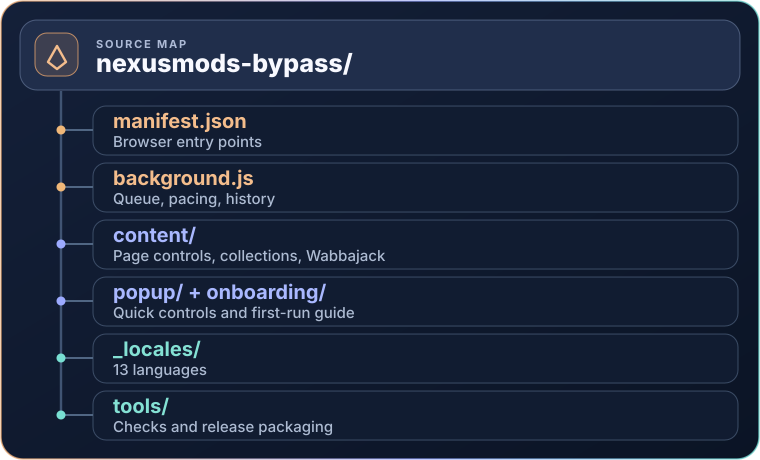

##  In short

Queue a Nexus Mods collection, choose **Vortex** or **browser download**, and let the extension handle the pages, pacing and resume history.

##  Features

- **Fewer clicks:** auto-start downloads, skip requirement screens and restore download buttons on archived files.
- **Collection queue:** batch downloads, choose the mode per run, smallest files first, pause between mods and resume after rate limits. Removed mods are skipped instead of stopping the run, and listed with the reason at the end.
- **Pick up where you left off:** local history, revision comparison and a time-left estimate in browser mode after the first file finishes.
- **Wabbajack (beta):** import a `.wabbajack` file or a `.zip` containing one. Extract `.rar` and `.7z` first.
- **Safer handoff:** Vortex tab countdown with **Keep open**, plus a browser fallback for Cloudflare verification and clear error messages.
- **Extras:** optional ad and Premium-panel hiding, guided setup, an editable bug report draft and an optional support panel.

**13 languages** and an **Always use English** switch are included.

##  Install

Use the **Chrome**, **Firefox** or **Edge** store button above. For manual installation:

<b>Manual Installation (Developer Mode)</b>

 

If you want to install manually from the source releases:

**Chrome, Edge, Brave, Opera**
1. Download the latest `nexus.mods.bypass-<version>.zip` from the [Releases page](https://github.com/thomasthanos/nexusmods-bypass/releases/latest).
2. Extract the `.zip` file into a new folder.
3. Open `chrome://extensions` (or `edge://extensions`).
4. Enable **Developer mode** in the top right.
5. Click **Load unpacked** and select the folder you just extracted.

**Firefox 140 or newer**
1. Download the latest `nexus.mods.bypass-<version>-firefox.zip` from the [Releases page](https://github.com/thomasthanos/nexusmods-bypass/releases/latest).
2. Open `about:debugging#/runtime/this-firefox`.
3. Click **Load Temporary Add-on** and select the `.zip` file directly (no need to extract it).

*Note: A temporary add-on is unloaded when Firefox closes. Installing it permanently requires downloading from the official AMO store.*

> **Vortex mode:** keep Vortex running. The browser can confirm a link was sent, but cannot confirm that Vortex completed the download.

##  Settings

Open the popup → **Page settings**. Changes save instantly; **Restore Defaults** resets them and refreshes the Nexus page.

<b>See all settings</b>

- **Download flow:** auto-start, close Vortex tabs, skip requirements, error popups, hide ads and Premium panels, archived file buttons, Wabbajack import, smallest files first, Cloudflare fallback.
- **Files & pacing:** browser download folder, Nexus download speed, pause between mods.
- **Advanced:** request timeout and close-tab delay.
- **Language:** Always use English.

##  Privacy & permissions

Settings, history and error logs stay in local extension storage. There are no analytics or extension accounts. Download requests go to Nexus Mods; the optional bug report opens a draft for you to review before submitting.

| Permission | Used for |
|---|---|
| `storage` | Settings and local download history. |
| `downloads` | Starting and tracking browser downloads. |
| `scripting` | Injecting the extension's packaged UI on Nexus pages as needed. |
| `alarms` | Pacing the background queue. |
| `https://www.nexusmods.com/*` | The only site the extension operates on. |

No tabs permission, all-URLs access or remote code. 

##  Source map

Contributors changing translations: run `node tools/check-locales.mjs`.

##  Quick fixes

<b>Downloads do not start</b>

Sign in to Nexus Mods and enable **Start downloads automatically** in Page settings.

<b>Vortex does not receive the file</b>

Start Vortex first. If it takes time to pick up links, increase **Close-tab delay**.

<b>The collection queue pauses or runs slowly</b>

Rate limits pause the queue temporarily; it resumes automatically. Keep the collection tab open and **Hide ads and Premium panels** enabled, so its ad-timer cookie stays current for the background queue.

<b>Already downloaded files start again</b>

Choose **Skip Downloaded** when the history dialog appears. Cleared history cannot identify files already on disk.

<b>Report a bug</b>

The popup's **Report a bug** button opens an editable GitHub draft with recent errors and activity. Review it before submitting.

##  Licence

Most code is source-available under the repository [licence](LICENSE). The *NexusMods Bypass* name, `src/icons/` and `internal/` are excluded from its permissions.

`src/content/nnw.js` is separately licensed [GPL-3.0-or-later](src/LICENSE-GPL-3.0-or-later.txt) and is based on [Nexus No Wait ++](https://github.com/torkelicious/nexus-no-wait-pp). Other original code, including `src/download-url-parser.js`, remains under the main licence. See the [third-party notices](THIRD-PARTY-NOTICES.md).

**Not affiliated with, endorsed by, or connected to Nexus Mods.**

